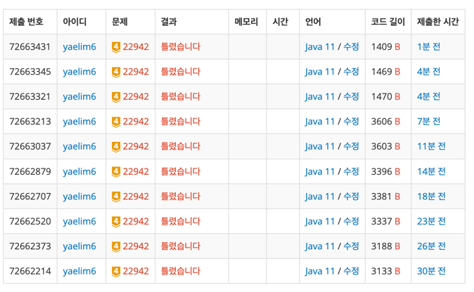

# [Baekjoon][GOLD4] 데이터 체커 / (WA)

---

> **문제 설명**
>

[[문제 링크](https://www.acmicpc.net/problem/22942)]
원 이동하기 2 문제를 만들고 만든 데이터가 문제의 조건에 맞는지 확인하는 코드를 작성해야한다.

해당 문제의 데이터는 아래 조건들을 만족해야한다.

모든 원의 중심 좌표는
$x$축 위에 존재해야 한다.
 
$N$개의 원 중 임의의 두 원을 선택했을 때, 교점이 존재하지 않아야 한다. 즉, 하나의 원이 다른 원 안에 존재하거나 외부에 존재한다.
데이터 형식은 원의 개수
$N$이랑 각 원의 중심
$x$좌표, 원의 반지름
$r$만 주어진다. 따라서, 2번 조건을 만족하는지만 확인하면 된다.

주어진 데이터가 해당 조건을 만족하는지 확인해보자.

---
> **제한사항**

### 입력<br>
첫 번째 줄에는 원의 개수
$N$이 주어진다.

두 번째 줄부터
$N+1$번째 줄까지 원의 중심
$x$좌표, 원의 반지름
$r$이 공백으로 구분되어 주어진다.

### 출력<br>

데이터가 조건에 맞는다면 YES, 조건에 만족하지 않는다면 NO를 출력한다.

---

> **후기**

진짜 .... 아침부터 로직짜고 하루종일 잡고있었는데 계속 틀렸다니까 개열받음.


일단 아래쪽에 올려둔 게 로직이긴한데, 스터디전까지 더 해결해가보겠슴다.

```
/* logic
    1. Node 구조를 생성하여 각 원의 중심점과 반지름 길이를 저장
    2. 원들을 중심점 기준으로 정렬하되, 중심이 같다면, 반지름이 더 긴 원을 고려하도록 정렬
    3. 스택에 Node 하나씩 넣으면서 현재 원과 스택의 top에 있는 원이 겹치는지 확인
        - 겹치면 -> 현재 원을 스택에 넣지 않아야 함.
        - 안 겹치면 -> 현재 원을 스택에 넣으면 됨.
     4. 모든 원 순회 후에도 스택에 원이 남아있으면 ? -> "YES"
     5. 중간에 겹치는 원이 있어서 스택에 못 들어간다면 ? -> "NO"*/
