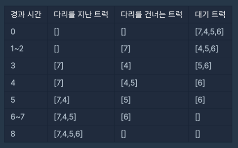
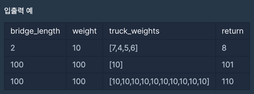

# [Programmers][Level2] 다리를 지나는 트럭  / (AC)

---

> **문제 설명**
>

[[문제 링크](https://school.programmers.co.kr/learn/courses/30/lessons/42583)]
트럭 여러 대가 강을 가로지르는 일차선 다리를 정해진 순으로 건너려 합니다. 모든 트럭이 다리를 건너려면 최소 몇 초가 걸리는지 알아내야 합니다. 다리에는 트럭이 최대 bridge_length대 올라갈 수 있으며, 다리는 weight 이하까지의 무게를 견딜 수 있습니다. 단, 다리에 완전히 오르지 않은 트럭의 무게는 무시합니다.

예를 들어, 트럭 2대가 올라갈 수 있고 무게를 10kg까지 견디는 다리가 있습니다. 무게가 [7, 4, 5, 6]kg인 트럭이 순서대로 최단 시간 안에 다리를 건너려면 다음과 같이 건너야 합니다.

따라서, 모든 트럭이 다리를 지나려면 최소 8초가 걸립니다.

solution 함수의 매개변수로 다리에 올라갈 수 있는 트럭 수 bridge_length, 다리가 견딜 수 있는 무게 weight, 트럭 별 무게 truck_weights가 주어집니다. 이때 모든 트럭이 다리를 건너려면 최소 몇 초가 걸리는지 return 하도록 solution 함수를 완성하세요.

---
> **제한사항**

- bridge_length는 1 이상 10,000 이하입니다.
- weight는 1 이상 10,000 이하입니다.
- truck_weights의 길이는 1 이상 10,000 이하입니다.
- 모든 트럭의 무게는 1 이상 weight 이하입니다.

---

---

> **후기**

데이터 체커에 비하면 진짜 ...진짜 후련한 문제 !

--- 
> **간단한 설명**

- 우선 트럭이 들어온 순서대로 나간다는 것에서 `큐`를 사용하여 풀어야할 문제라는 것으로 접근을 시작했다.
- 다리에 트럭을 넣는 조건을 3가지로 쪼게었다.
    - 큐가 비어있는 경우
      - 큐가 비어있는 경우는 다리에 어떠한 트럭도 올라가지 않은 경우와 같다. 이럴 땐 그냥 트럭을 다리에 올려주면 됨 -> 큐에 넣어주고
      - 트럭이 다리위에 올라갔으므로 시간은 +1
    - 큐가 (다리 길이만큼) 가득 차지 않은 경우
      - 이미 다리에 있는 트럭의 무게와 다리에 올릴 다음 트럭의 무게를 비교해 다리에 올릴지 말지를 결정해야 함.
    - 큐가 가득 찬 경우
      - 큐에서 트럭이 내려야한다!
      - poll() 메서드를 이용해 트럭이 다리를 건너도록 해준다. 다리에서 내릴 때는 시간이 들지 않는다.
